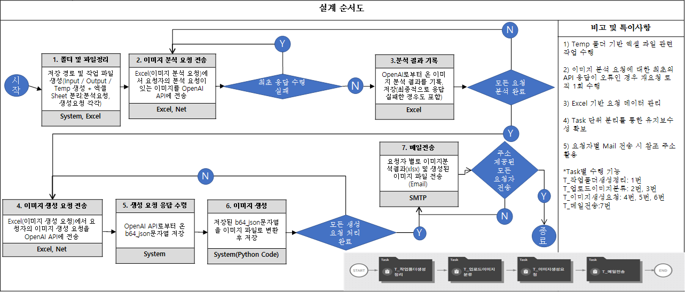

# Portfolio


# 연형석

**Python Backend Developer | RPA Developer**

---

---

# About Me :Why Development?

### 문제를 반복하지 않기 위해 시스템을 만드는 사람

방대한 정보를 반복적으로 찾고 정리하며 의사결정을 내리는 과정에 있어서, 단순히 주어진 기존의 도구에 의존한 노력을 반복하기 보다는 **문제를 구조화하고 시스템으로 해결하는 방식**을 찾아내는 것이 저에게 가장 재미있다고 느껴졌기 때문에 로스쿨을 졸업했음에도 개발자의 길을 걷게 되었습니다.

이후 Python과 Flask를 활용한 웹 서비스 개발, Brity RPA를 이용한 업무 자동화, OutSystems 기반 애플리케이션 개발, 법령 QA Retrieval 시스템 설계 프로젝트를 수행하며 **반복적인 문제를 기술로 해결하는 경험**을 쌓았습니다.

기술 자체보다도 **기술이 해결하는 문제**에 더 관심을 가지며, 사용자의 불편함과 업무의 비효율을 개선하는 개발자가 되고자 합니다.

---

---

# Project Overview-Brity RPA

| Project | 적용 기술 |
| --- | --- |
| AI 이미지 분석 및 생성 자동화 시스템  | Brity RPA · OpenAI API · Python · Excel · JSON · SMTP |
| 자동차 판매 실적 자동 수집 시스템   | Brity RPA · Chrome Web Automation · Excel · Dictionary, JavaScript |
| SRT 열차 정보 자동 조회 시스템 | Brity RPA · Chrome Web Automation · Excel |
| 로또 당첨번호 통계 자동화 시스템   | Brity RPA · Chrome Web Automation · Excel |

---

---

# Brity RPA Project 01. AI 이미지 분석 및 생성 자동화 시스템

## 사용자 별 요청에 대응한 AI 프롬프트 기반 이미지 생성 및 저장, 전송

> **기간: 2026.05.26~2026.05.29**
> 
> 
> **인원** : 개인 프로젝트
> 
> **기술** : Brity RPA · OpenAI API · Python · Excel · JSON · SMTP
> 
> 저장소: [https://drive.google.com/drive/folders/1zjT7PtZ4-S3Uw8AGyyzOVVuz9I39s4zL?usp=sharing](https://drive.google.com/drive/folders/12EwJnGvbCr_fPgmYOKkM1tjhEurSRoQ1?usp=sharing)
> 

# 1. Work Flow



# 2. 주요 기능

### 이미지 분석 자동화

- Excel 요청 데이터 읽기
- 이미지 업로드
- OpenAI API 분석 요청
- JSON 응답 Parsing
- 분석 결과 저장

---

### 이미지 생성 자동화

- 분석 결과를 기반으로 이미지 생성 요청
- 생성 결과(Base64) 수신
- Python Script를 이용한 PNG 이미지 변환
- Output 폴더 자동 저장

---

### 메일 자동 발송

- 생성 이미지 자동 첨부
- 생성 완료 여부 확인
- SMTP를 이용한 결과 메일 자동 발송

---

# 3. 수행결과(OpenAI API의 응답, 메일 전송)


# 4. 프로젝트를 통해 얻은 점

이번 프로젝트를 통해 단순히 RPA Workflow를 구현하는 것을 넘어 **외부 AI 서비스와 업무 자동화를 연계하는 방법**을 경험할 수 있었습니다.  그리고 OpenAI API로부터 받은 이미지 생성 요청 응답이 base64의 형태였고, 이를 외부에서 미리 만들어진 파이썬 파일을 적용하여 실제 이미지 파일로 변환시키는 것이 RPA 내부에서도 구현 가능하다는 것을 배웠는데, 이로써 코딩으로 처리해야 하는 영역과 코딩 없이 RPA내부의 task로 처리해야 하는 영역 사이를 나누는 경계가 존재함을 학습하였습니다. 마지막으로, API 호출 실패에 대비하여 요청 재시도 로직을 적용하는 과정에 있어서도 오류의 방지가 업무 자동화에서 가장 중요한 요소 중 하나 임을 깨닫게 해주었습니다.

---

---

# Brity RPA Project 02. 자동차 판매 실적 자동 수집 시스템

## 제조사별 판매량 수집 및 Excel 보고서 자동 생성

> **기간: 2026.06.01~2026.06.05**
> 
> 
> **인원** : 개인 프로젝트
> 
> **기술** : Brity RPA · Chrome Web Automation · Excel · Dictionary, JavaScript
> 
> 저장소: [https://drive.google.com/drive/folders/1zjT7PtZ4-S3Uw8AGyyzOVVuz9I39s4zL?usp=sharing](https://drive.google.com/drive/folders/1zjT7PtZ4-S3Uw8AGyyzOVVuz9I39s4zL?usp=sharing)
> 

# 1. Work Flow


# 2. 주요 기능

### 판매 실적 자동 조회

- 제조사별 판매 실적 조회
- 판매량 데이터 추출
- 점유율 정보 추출
- 전월·전년 대비 증감률 추출

---

### 그래프 자동 저장

- 누적 판매 그래프 자동 캡처
- Excel 보고서에 자동 삽입

---

### Excel 보고서 생성

- 브랜드별 Worksheet 생성
- 판매 데이터 자동 입력
- 셀 서식 자동 적용
- 결과 파일 저장

---

# 3. 수행결과


---

# 4. 담당 역할

### Workflow 설계

업무를 기능별 Task로 분리하였습니다.

- Task1 : 작업환경 생성
- Task2 : 브랜드 Dictionary 생성
- Task3 : 판매 데이터 조회 및 보고서 생성

공통적으로 사용하는 폴더 경로는 Global 변수로 관리하고, Task 간에는 Input/Output 변수를 활용하여 데이터를 전달하도록 설계했습니다.

---

### Web Automation

Chrome Web Automation을 이용하여 다나와 자동차 사이트에서 제조사별 판매 실적을 자동 조회했습니다.

사용자가 입력한 브랜드와 조회 기간을 바탕으로 판매 데이터를 수집하고, 누적 판매 그래프를 자동 캡처하도록 구현했습니다.

---

### 데이터 후처리

웹에서 추출한 판매 데이터는 보고서 형식과 달라 바로 사용할 수 없었습니다.

2차원 배열 형태로 수집된 데이터를 1차원 구조로 재구성하고, 필요한 정보만 추출하여 Excel 보고서 형식에 맞게 가공했습니다. 또한 전월·전년 대비 증감률을 분석하여 상승은 빨간색, 하락은 파란색으로 자동 표시하도록 구현했습니다.

---

### Dictionary 활용

브랜드명과 브랜드 코드를 Dictionary로 관리하여 사용자가 입력한 브랜드에 따라 URL을 자동 생성하도록 구현했습니다.

이를 통해 브랜드 코드 변경이나 신규 브랜드 추가 시 별도의 코드 수정 없이 대응할 수 있도록 설계했습니다.

# 5. 프로젝트를 통해 얻은 점

 **브랜드-코드 정보를 Dictionary**로 관리하여 유지보수성을 높이고, 웹에서 추출한 데이터를 원하는 형태로 가공하는 로직을 구현하면서 **자동화 시스템은 단순한 반복 작업이 아니라 데이터 구조와 업무 흐름까지 함께 설계해야 한다**는 점을 배울 수 있었습니다. 또, 크롤링 페이지의 html 구조, 페이지 자체에서 뽑아내고자 하는 자료가 있는 물리적인 위치 등 **여러 각도**에서 목적하는 자료의 추출을 성공하기 위해 **다양한 수단**을 시도해보는 경험을 얻었습니다.

---

---

# Brity RPA Project 03. SRT 열차 정보 자동 조회 시스템

## 열차 시간 및 좌석 정보 조회

> **기간: 2026.06.08~2026.06.12**
> 
> 
> **인원** : 개인 프로젝트
> 
> **기술** : Brity RPA · Chrome Web Automation · Excel
> 
> 저장소: [https://drive.google.com/drive/folders/1zjT7PtZ4-S3Uw8AGyyzOVVuz9I39s4zL?usp=sharing](https://drive.google.com/drive/folders/1w4bXlyhkYodaFM2Ya_svhIj6V56N-Oej?usp=sharing)
> 

# 1. Work Flow

.svg)

---

# 2. 주요 기능

### 열차 정보 자동 조회

- 출발역·도착역 입력
- 출발일 및 시간 입력
- 여행 기간 계산
- 왕복 열차 자동 조회

---

### 운행 정보 수집

- 출발 시간
- 도착 시간
- 소요 시간
- 특실 예매 가능 여부
- 일반실 예매 가능 여부
- 운임 정보 자동 수집

---

### Excel 보고서 생성

- 조회 결과 자동 저장
- 중복 데이터 제거
- 보고서 자동 생성

---

# 3. 담당 역할

### Workflow 설계

사용자가 입력한 조건을 바탕으로 조회를 수행하고, 왕복 데이터를 순차적으로 수집한 뒤 하나의 보고서로 통합하도록 구현했습니다.

---

### Web Automation

Chrome Web Automation을 활용하여 SRT 예약 사이트를 자동 탐색했습니다.

출발역, 도착역, 날짜, 시간 등의 입력값을 자동으로 설정하고 조회 결과를 반복적으로 탐색하여 열차 정보를 수집했습니다.

---

### 반복 탐색 및 데이터 처리

조회 결과가 여러 페이지에 걸쳐 표시되는 경우 반복문을 이용하여 모든 열차 정보를 수집하도록 구현했습니다.

또한 동일한 열차 정보가 중복 저장되지 않도록 중복 제거 로직을 적용하여 데이터의 정확성을 높였습니다.

---

# 4. 실행과정 및 수행결과


---

# 5. 프로젝트를 통해 얻은 점

이번 프로젝트를 통해 **동적인 웹 페이지를 자동으로 탐색하고 반복적으로 데이터를 수집하는 Workflow를 설계하는 경험**을 쌓을 수 있었습니다.

특히 사용자 입력에 따라 조회 조건이 달라지는 환경에서 반복문과 조건문을 활용하여 다양한 상황에 대응하는 자동화 로직을 구현하면서, 단순한 Web Automation을 넘어 실제 업무에서 활용 가능한 자동화 프로세스를 설계하는 방법을 익힐 수 있었습니다.

---

---

# Brity RPA Project 04. 로또 당첨번호 통계 자동화 시스템

## 회차별 당첨번호 및 통계 자동 수집

> **기간: 2026.06.26**
> 
> 
> **인원** : 개인 프로젝트
> 
> **기술** : 로또 당첨번호 통계 자동화 시스템 
> 
> 저장소: [https://drive.google.com/drive/folders/1zjT7PtZ4-S3Uw8AGyyzOVVuz9I39s4zL?usp=sharing](https://drive.google.com/drive/folders/1w6s3RI80sgnFW6PHr_FCXX-1_UWrVSKt?usp=sharing)
> 

---

# 1. 프로젝트 개요

동행복권 홈페이지에서 최신 로또 당첨번호를 자동으로 수집하고, 번호별 출현 빈도를 분석하여 Excel 통계 보고서를 생성하는 업무 자동화 시스템을 구현한 프로젝트입니다.

기존에는 회차별 당첨번호를 직접 조회하고 통계를 계산해야 했지만, Brity RPA를 활용하여 **데이터 수집부터 통계 계산 및 보고서 생성까지의 전 과정을 자동화**하였습니다.

---

# 2. 주요 기능

### 당첨번호 자동 수집

- 최신 회차 조회
- 최근 10회차 반복 조회
- 회차별 당첨번호 추출
- 보너스 번호 수집

---

### Excel 통계 자동 생성

- 회차별 데이터 자동 입력
- 번호별 출현 빈도 계산
- COUNTIF 수식 자동 생성
- 셀 서식 자동 적용

---

### 보고서 생성

- 통계 결과 자동 계산
- 결과 파일 저장
- 보고서 자동 생성

---

# 3. 수행 결과


---

# 4. 프로젝트를 통해 얻은 점

반복적인 데이터 수집을 넘어서 **Excel 수식을 활용한 데이터 분석에 기초한 보고서 작성 자동화**를 경험할 수 있었으며, Brity RPA가 **데이터 분석과 보고서 생성 업무까지 자동화할 수 있는 도구로써** 향후 자동화가 적용될 수 있는 영역이 상당히 방대할 것이라는 점을 깨닫게 해주었습니다.

---

---

# Other Project Overview

| Project | 핵심역량 |
| --- | --- |
| Salon De Nature | Backend |
| LOL CRUD | Low-code |
| Law Retrieval | Data Design |

---

---

# Project 01. Salon De Nature

## 실제 네일샵 운영의 비효율을 해결하기 위한 예약 관리 시스템

> **기간: 2026.05~2026.07**
> 
> 
> **인원** : 개인 프로젝트
> 
> **기술** : Python · Flask · MySQL · AWS EC2 · Google OAuth · Kakao OAuth
> 
> GitHub: [https://github.com/OrientingFreeman/SalonDeNature_ManagementSystem](https://github.com/OrientingFreeman/SalonDeNature_ManagementSystem)
> 
> Demo: [https://salondenature.shop](https://salondenature.shop) 
> 

---

# 1. 프로젝트 배경

지인이 운영하는 네일샵에서는 예약을 전화와 수기 장부를 통해 관리하고 있었으며, 사업운영자가 예약 내용을 직원들에게 개별적으로 전달하는 방식으로 운영되고 있었습니다.

이 과정에서 예약 변경 사항을 실시간으로 공유하기 어렵고, 예약 누락이나 중복 예약이 발생할 가능성이 존재했습니다. 또한 고객 정보와 예약 이력을 체계적으로 관리하기 어려워 업무 효율이 떨어지는 문제가 있었습니다.

이러한 문제를 해결하기 위해 실제 운영자의 요구사항을 반영한 **웹 기반 예약 관리 시스템**을 직접 설계하고 개발했습니다.

---

# 2. 문제 정의

#### 문제점

- 예약 정보가 실시간으로 공유되지 않음
- 예약 변경 사항을 반복적으로 전달해야 함
- 직원별 예약 현황을 한눈에 확인하기 어려움
- 예약 시간 중복 가능성 존재
- 고객 방문 이력 관리 어려움

---

## 시스템 설계 목표

```
고객 예약
      │
      ▼
예약 시스템
      │
      ▼
예약 가능 여부 검증
      │
      ▼
DB 저장
      │
      ▼
관리자 / 직원 실시간 조회
```

---

# 3. 시스템 설계

## Architecture


---

## ERD

### 주요 Entity

- User
- Employee
- Reservation
- Service
- Holiday
- Customer


예약(Reservation)을 중심으로 고객(Customer), 직원(Employee), 서비스(Service)를 연결하는 구조로 설계하였으며, 직원 휴무(Holiday)를 별도로 관리하여 예약 가능 여부를 판단하도록 구성했습니다.

---

# 4. 주요 기능

## 사용자 권한(Role)

| 역할 | 기능 |
| --- | --- |
| 고객 | 예약 생성 및 조회 |
| 직원 | 본인 예약 조회 |
| 관리자 | 예약 관리, 직원 관리, 서비스 관리 |

---

## 예약 관리

- 예약 생성
- 예약 변경
- 예약 취소
- 예약 조회

---

## OAuth 로그인

- Google OAuth 로그인
- Kakao OAuth 로그인

---

## 관리자 기능

- 직원 관리
- 서비스 관리
- 예약 현황 조회
- 직원 배정

---

# 5. 핵심 구현 내용

## 예약 중복 검증 로직

가장 중요하게 구현한 기능은 **예약 가능 여부를 판단하는 비즈니스 로직**이었습니다.

예약 생성 또는 변경 시 다음 순서로 검증을 수행했습니다.

```
예약 요청
      │
      ▼
서비스 소요 시간 계산
      │
      ▼
선택 직원 예약 조회
      │
      ▼
시간 구간 중복 여부 확인
      │
      ▼
휴무일 여부 확인
      │
      ▼
예약 생성
```

검증 과정에서는 서비스별 소요 시간을 기준으로 예약 종료 시간을 계산하고, 동일 직원의 기존 예약과 시간이 겹치는 경우 예약이 생성되지 않도록 구현했습니다. 또한 직원의 휴무일 및 반차 일정도 함께 확인하여 예약 가능 여부를 판단했습니다.

---

## 권한(Role) 기반 접근 제어

시스템은 고객, 직원, 관리자 역할을 분리하여 구현했습니다.

- 고객은 자신의 예약만 조회 가능
- 직원은 본인에게 배정된 예약 조회 가능
- 관리자는 모든 예약과 직원 정보를 관리 가능

권한에 따라 화면과 기능을 구분하여 실제 서비스 운영 환경을 고려했습니다.

---

# 6. 기술적 고민

## 예약 시스템에서 가장 어려웠던 점

예약 시스템은 단순한 CRUD가 아니라 **시간**을 관리하는 문제였습니다.

서비스마다 소요 시간이 다르기 때문에 단순히 예약 시작 시간만 비교해서는 중복 여부를 판단할 수 없었습니다.

이를 해결하기 위해 서비스 시간을 기준으로 예약 종료 시간을 계산하고, 시작 시간과 종료 시간을 모두 비교하는 방식으로 중복 여부를 검증했습니다.

또한 직원의 휴무일과 반차 일정까지 함께 고려하여 실제 운영 환경에서 사용할 수 있는 예약 검증 로직을 설계했습니다.

---

# 7. 프로젝트를 통해 얻은 점

이번 프로젝트를 통해 단순히 웹 애플리케이션을 구현하는 것을 넘어, **실제 사용자의 요구사항을 분석하고 이를 시스템으로 구현하는 과정**을 경험할 수 있었습니다. 권한 관리, 예약 검증, 데이터베이스 설계 등 다양한 비즈니스 로직을 직접 설계함으로써 사용자 중심의 요구사항을 반영하였고, 실제 운영 환경에서도 적용할 수 있는 시스템을 설계, 운영할 수 있게 되었습니다.

---

---

# Project 02. LOL 챔피언 조회 및 개인 저장 시스템

## OutSystems 기반 CRUD 및 권한 관리 시스템

> **기간: 2026.06.**
> 
> 
> **인원:** 개인 프로젝트
> 
> **기술**
> 
> OutSystems · SQL
> 

---

# 프로젝트 개요

리그 오브 레전드(League of Legends)에 존재하는 챔피언 정보를 관리하고, 사용자가 선호하는 챔피언을 저장할 수 있는 웹 애플리케이션을 개발했습니다.

프로젝트에서는 챔피언 정보 조회, 검색, CRUD 기능 뿐만 아니라 사용자 권한에 따른 기능 분리와 Entity 간 관계 설정을 경험하는 것을 목표로 했습니다.

---

# 프로젝트 목표

사용자가 게임 내 모든 챔피언 정보를 쉽게 조회하고, 자신이 선호하는 챔피언을 저장할 수 있는 서비스를 구현하는 것이 목표였습니다.

관리자는 챔피언 정보를 수정할 수 있으며, 일반 사용자는 자신만의 즐겨찾기 목록을 관리할 수 있도록 역할(Role)을 구분하여 시스템을 설계했습니다.

---

# 주요 기능

- 챔피언 목록 조회
- 갤러리 형태 UI 제공
- 이름 기반 검색
- 포지션 기반 검색
- 즐겨찾기 등록 및 삭제
- 관리자 전용 챔피언 정보 수정

---

# 담당 역할

### 데이터 모델 설계

사용자(User)와 챔피언(Champion) 간 다대다(M:N) 관계를 설정하여 사용자가 여러 챔피언을 즐겨찾기에 등록할 수 있도록 Entity를 구성했습니다.

---

### 기능 구현

- 챔피언 CRUD
- 챔피언 검색 기능
- 즐겨찾기 등록/삭제
- 관리자 권한 관리
- 갤러리 UI 구현

---

# 핵심 구현

## Role 기반 권한 관리

관리자와 일반 사용자의 권한을 분리하여 기능에 대한 접근을 제어했습니다.

| 사용자 | 기능 |
| --- | --- |
| 일반 사용자 | 조회, 검색, 즐겨찾기 |
| 관리자 | 조회, 검색, 챔피언 정보 수정 |

---

## 프로젝트를 통해 얻은 점

이번 프로젝트를 통해 단순한 CRUD 구현을 넘어 **Entity 간 관계 설계와 권한(Role) 기반 접근 제어**를 경험할 수 있었습니다.

특히 사용자와 챔피언 간의 관계를 데이터 모델로 표현하고, 권한에 따라 기능을 분리하면서 실제 서비스에서 필요한 기본적인 백엔드 설계가 OutSystems를 통해 어떻게 이루어질 수 있는 것인지 배울 수 있었습니다.

---

---

# Project 03. 법령 QA Retrieval 시스템 설계

## 법령 도메인을 고려한 Retrieval 시스템 설계 및 성능 평가

> **기간** : 2026.04~2026.05
> 
> 
> **인원** : 개인 프로젝트
> 
> **기술**
> 
> Python
> 

---

# 프로젝트 개요

LLM을 활용한 법률 질의응답 시스템에서는 잘못된 법령을 검색하거나 근거 없는 답변(Hallucination)이 생성되는 문제가 발생할 수 있습니다.

본 프로젝트에서는 이러한 문제를 해결하기 위해 **법령 문서의 구조를 반영한 Retrieval 시스템을 설계하고, 검색 성능을 평가하는 과정**을 수행했습니다.

단순히 RAG를 구현하는 것이 아니라 Retrieval 단계에서 발생하는 실패 원인을 분석하고 검색 품질을 개선하는 방향을 제안하는 것을 목표로 했습니다.

---

# 문제 정의

기존 법령 QA 시스템에서는 다음과 같은 문제가 발생할 수 있습니다.

- 잘못된 조문 검색
- 개정 법령 미반영
- Hallucination 발생
- 출처가 명확하지 않은 답변
- 검색 실패(Failure Case)

따라서 **정확한 Retrieval이 전체 QA 시스템의 품질을 결정하는 핵심 요소**라고 판단했습니다.

---

# 해결 방법

    

본 프로젝트에서는 Retrieval 과정을 왼쪽과 같이 설계하였고, 향후 프로젝트를 전체 RAG과정을 구현하는 방향으로 확장할 경우 오른쪽과 같은 구조가 될 예정입니다.

---

# 핵심 구현

## Metadata Schema 설계

법령의 특성을 반영하기 위해 다음과 같은 Metadata를 설계했습니다.

- 법령명
- 조문 번호
- 시행일
- 개정일
- 주제
- 키워드
- 신뢰도

이를 통해 단순한 키워드 검색이 아니라 법령 정보를 구조적으로 관리할 수 있도록 설계했습니다.

---

## Chunking 전략

일반 문서처럼 일정 길이로 분할하지 않고, **법령의 의미 구조를 유지하기 위해 조문(Article) 단위로 Chunking**을 수행했습니다.

필요한 경우에는 항(Clause), 호(Item) 단위까지 확장 가능한 구조를 고려했습니다.

---

## Retrieval 평가

Retrieval 품질을 평가하기 위해 다음 지표를 설계했습니다.

- Hit@K
- Top-1 Accuracy

특히 법령 QA에서는 **Top-K에 정답이 포함되는 것보다 첫 번째 검색 결과가 정확한지(Top-1 Accuracy)**가 실제 서비스 품질에 더 큰 영향을 준다고 판단하여 주요 평가 지표로 활용했습니다.

---

## Failure Case 분석

Keyword 기반 Retrieval은 동일한 키워드를 포함하는 여러 조문을 구분하지 못하는 문제가 있었습니다.

예를 들어 **"손해배상"**이라는 질의는 민법 제390조와 제750조 모두 검색될 수 있었으며, 단순 Keyword Matching만으로는 사용자의 의도를 정확히 반영하기 어려웠습니다.

이를 개선하기 위해

- Semantic Search
- Query Expansion
- Reranking

등의 개선 방향을 제안했습니다.

---

# 프로젝트를 통해 얻은 점

이번 프로젝트를 통해 **LLM의 성능보다 Retrieval의 품질이 서비스의 정확도에 있어서 결정적인 요인임**을 확인할 수 있었습니다.

또한 단순히 기능을 구현하는 것보다 **문제를 정의하고 평가 기준을 설계하며 개선 방향을 제시하는 과정이 시스템 설계에서 중요한 역할을 한다는 점**을 배웠습니다.

---

# GitHub

> github.com/OrientingFreeman/law-rag-qa-planner
>